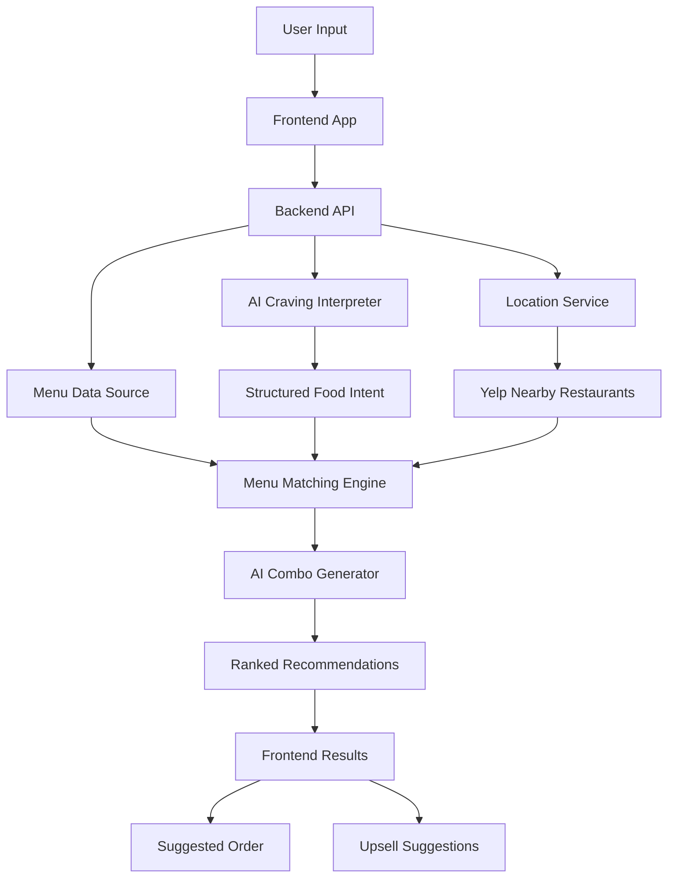

# CouchMunch
CouchMunch is an AI-powered food recommendation app that turns cravings into nearby meal combos. Users enter foods they want plus a location, and the app suggests nearby restaurants with curated order ideas.

# Problem
Food apps overwhelm users with too many restaurant and menu choices. CouchMunch reduces decision fatigue by using AI to interpret cravings, Yelp Fusion to find nearby restaurants, and a lightweight combo engine to suggest what to order.

# MVP Features:
- AI craving interpretation
- Yelp-powered nearby restaurant matching
- Combo recommendation engine
- Best Match / Cheapest / Munch Mode suggestions
- Mock checkout integration
- Add-on recommendations

# Recommendation Modes
- Best Match - Best AI interpretation of what the user is craving and what is nearby.
- Cheapest - Cheapest option based on the AI interpretation of the user's craving.
- Munch Mode - The best of both worlds: affordable, great ratings, relatively nearby, and the closest CouchMunch interpretation of what the user wants.

# Current MVP Implementation
- Frontend Next.js app for entering cravings, using browser location, choosing a budget, viewing ranked combos, selecting add-ons, and creating a mock checkout.
- Backend Express API with `/api/recommendations`, `/api/checkout`, and `/api/health`.
- Yelp Fusion restaurant endpoints for credential status and nearby restaurant search.
- AI endpoints for status checks and standalone craving interpretation.
- Yelp Fusion is optional. If `YELP_API_KEY` is not configured, the API uses mock restaurant data in `backend/data/mockMenus.json`.
- OpenAI craving interpretation and post-Yelp restaurant ranking are optional. If `OPENAI_API_KEY` is not configured, the API uses local heuristic interpretation and ranking so the demo works immediately.
- Endpoint connection details are documented in `ENDPOINT_SETUP_INSTRUCTIONS.txt`.
- Local verification and cloud deployment steps are documented in `DEPLOYMENT_RUNBOOK.md`.

# Technology Stack
## Frontend


## Backend


## AI


<!--## Database


-->


## APIs


# System Architecture

# AI Interpretation & Response Example 
## AI Interpretation 
```json
{
  "items": ["burger", "fries", "milkshake"],
  "category": "fast_food",
  "priority": "combo_match"
}
```

## Recommendation Response
```json
{
  "recommendations": [
    {
      "type": "Best Match",
      "restaurant": "Burger Palace",
      "combo": [
        "Double Cheeseburger",
        "Large Fries",
        "Chocolate Shake"
      ],
      "estimatedPrice": 16.47
    }
  ]
}

```
# Project Structure
```bash
couchmunch/
├── frontend/
│   ├── src/
│   ├── public/
│   └── package.json
│
├── backend/
│   ├── routes/
│   ├── services/
│   ├── data/
│   │   └── mockMenus.json
│   ├── package.json
│   ├── .env.example
│   └── server.js
│
├── README.md
└── .gitignore
```
# Setup Instructions

## 1. Clone Repository

```bash
git clone https://github.com/YOUR_USERNAME/couchmunch.git
cd couchmunch
```

---

## 2. Install Dependencies

### Backend

```bash
cd backend
npm install
```

### Frontend

```bash
cd ../frontend
npm install
```

You can also install both apps from the repository root:

```bash
npm run install:all
```

---

## 3. Copy Environment File

Users only need to copy the backend example environment file once.

```bash
cd ../backend
cp .env.example .env
```

---

## 4. Configure Environment Variables

### Backend `.env`

```env
OPENAI_API_KEY=your_openai_api_key
OPENAI_MODEL=gpt-4o-mini
AI_PROVIDER=auto
AI_RECOMMENDATION_MODE=auto
RESTAURANT_DATA_SOURCE=auto
YELP_API_KEY=your_yelp_fusion_api_key
YELP_SEARCH_RADIUS_METERS=8000
PORT=5000
```

The backend runs without OpenAI or Yelp keys by using local fallback interpretation and mock restaurant data.

---

## 5. Start Backend Server

```bash
cd backend
npm run dev
```

Backend runs on:

```txt
http://localhost:5000
```

---

## 6. Start Frontend

```bash
cd ../frontend
npm run dev
```

Frontend runs on:

```txt
http://localhost:3000
```

Optional frontend environment:

```bash
cd frontend
cp .env.example .env.local
```

Set `NEXT_PUBLIC_GITHUB_REPOSITORY_URL` in `frontend/.env.local` if the public repository URL changes.

# Revenue Model
- Sponsored restaurant placements
- Affiliate delivery links
- Add-on recommendations
- Premium personalization

# Future Feature Goals
- Real delivery API integrations
- Personalized recommendations
- Group ordering
- Budget filtering
- Late-night food mode
- AI meal ranking

# License
Copyright (c) 2026 Josue Cruz.

CouchMunch is open source under the MIT License. See [LICENSE](LICENSE) for details.
